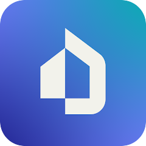
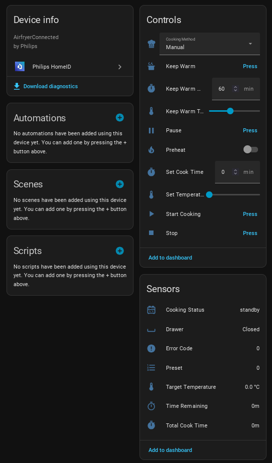

<p align="center">
  
</p>

# Philips HomeID Integration for Home Assistant

[](https://github.com/renaudallard/homeassistant_philips_homeid)
[](https://github.com/renaudallard/homeassistant_philips_homeid/releases)
[](https://github.com/renaudallard/homeassistant_philips_homeid/releases)
[](LICENSE)

Control your Philips domestic appliances through Home Assistant. Local control for most devices, cloud relay for FUSION devices.

<p align="center">
  
</p>

---

## Supported Devices

| Category | Models | Architecture | Notes |
|----------|--------|--------------|-------|
| **Air Purifiers** | AC0650, AC0651, AC series | | Local network connectivity required |
| **Air Fryers** | HD9200, HD9255, HD9280, HD9285 | SPECTRE | Single basket, port `airfryer` |
| **Air Fryers** | HD9875, HD9876 | VENUS 1 | Single basket, port `venus1af` |
| **Air Fryers** | HD9880 | VENUS 2 | Single basket, port `venusaf` |
| **Multicookers** | NX0960 | NUTRIMAX | Port `nutrimax` |
| **Multicookers** | NX0950 | HERMES | Port `hermesac` |
| **Espresso Machines** | EP8757 | RITA | Cloud relay (FUSION MQTT) |
| **Espresso Machines** | EP3546, EP2520, SM series | | Legacy HSDP / Condor, needs tester |

> **Note:** Some devices report their internal codename (e.g., "Venus2", "Spectre") instead of the marketing model number (e.g., "HD9880"). The integration recognizes both.
>
> **Note:** Some newer devices are registered as FUSION devices in the Philips cloud and do not have local credentials. These devices are now supported via cloud MQTT relay, which communicates through the Philips cloud (requires internet). The integration detects FUSION devices automatically during setup. See [Cloud Relay (FUSION devices)](#cloud-relay-fusion-devices) for details.

---

## Features

| Feature | Description |
|---------|-------------|
| **Local Control** | Direct communication over your local network |
| **Auto Discovery** | Automatic device detection via Zeroconf/SSDP |
| **Smart Polling** | Configurable intervals (default 60s idle / 10s cooking) |
| **Extrapolated Timers** | Smooth countdown updates between polls |
| **Dynamic Entities** | Sensors created only when device reports data |
| **Firmware Updates** | Shows installed and available firmware versions |
| **Diagnostics** | Built-in diagnostics for troubleshooting |
| **Cloud Login** | Retrieve credentials from Philips cloud via your account |
| **Cloud Relay** | FUSION devices supported via MQTT cloud relay (requires internet) |

### Air Purifiers
- Fan speed and preset modes (auto, manual, sleep, turbo, allergen, bacteria, night)
- Air quality sensors: PM1, PM2.5, PM10, TVOC, gas, allergen index
- Environment sensors: humidity, temperature
- Filter status: pre-filter, HEPA, carbon, humidifier wick
- Controls: power, child lock
- MUJI devices (AC0650/AC0651): beep volume, sensor monitor, air quality threshold, filter lifetime tracking

### Air Fryers
- Cooking status, temperature (target/current), time remaining
- Controls: start, pause, stop, keep warm, temperature, cook time, preheat toggle
- Cooking method select (architecture-specific presets)
- Sensors: drawer state, preheat status, shake/flip reminders
- Venus devices: air speed, probe temperature, dialog, voltage, previous status
- AutoCook program tracking (UUID, doneness, amount, weight, thickness)
- Recipe stage tracking
- Multiple device architectures supported (SPECTRE, VENUS 1, VENUS 2)

### Multicookers
- Same cooking controls as air fryers (start, pause, stop, keep warm)
- Sensors: humidity, ingredient, temperature, cooking status
- Binary sensors: lid open, no water
- Architecture-specific cooking presets (Nutrimax: 10 methods, Hermes: 14 methods)

### Espresso Machines (Rita)
- Power on/off via shadow
- Brew a saved profile recipe or a built-in drink id
- One-tap Brew Hot Water using the active profile
- Abort, resume and skip step during a brew
- Select roast level (light/medium/dark) and bean type (arabica/mix/other)
- Sensors: machine state, running status, active alert, control status, autonomies (AquaClean, descale, coffee, brew group), AquaClean filter number

---

## Installation

### HACS (Recommended)

Click the button to add this repository to HACS:

[](https://my.home-assistant.io/redirect/hacs_repository/?owner=renaudallard&repository=homeassistant_philips_homeid&category=integration)

Then click **Download** and restart Home Assistant.

<details>
<summary><b>Manual HACS steps</b></summary>

1. Open HACS in Home Assistant
2. Click the menu (three dots) in the top right corner
3. Select **Custom repositories**
4. Add this repository: `https://github.com/renaudallard/homeassistant_philips_homeid`
5. Select **Integration** as the category
6. Click **Add**
7. Search for **Philips HomeID** and click **Download**
8. Restart Home Assistant

</details>

### Manual Installation

1. Download `philips_homeid.zip` from the latest [GitHub Release](https://github.com/renaudallard/homeassistant_philips_homeid/releases)
2. Extract and copy the `philips_homeid` folder to your Home Assistant's `custom_components` directory
3. Restart Home Assistant

---

## Configuration

### Prerequisites

Your device must first be paired with the **official Philips HomeID app** on Android or iOS. The app handles the initial device pairing (including WiFi setup). This integration retrieves the credentials needed for device communication either automatically from the Philips cloud (local credentials or MQTT relay for FUSION devices) or manually from the app's local storage.

### Adding a Device

#### Auto-discovered devices
Devices discovered via Zeroconf or SSDP appear automatically as a notification. Clicking the notification starts the setup flow with cloud login.

#### Manual setup
1. Go to **Settings** > **Devices & Services** > **Add Integration**
2. Search for **Philips HomeID**
3. Enter the device's IP address and select your device model from the dropdown
4. Enter your Philips HomeID account email
5. Wait while required components are installed (first run only)
6. Enter the verification code sent to your email
7. Select your device from the list and credentials are retrieved automatically

> **Important:** Select the correct device model. Auto-detect probes multiple endpoints which can overwhelm and crash the device's web server. Use auto-detect only if your model is not listed.

> **Note:** All entities may take a few minutes to appear after setup. The integration needs one polling cycle to establish authentication with the device before all sensors become available.

If cloud login is not available on your platform, or you prefer to enter credentials manually, check **Enter credentials manually instead** on the email form. See [Extracting Credentials](#extracting-credentials-manual-alternative) for how to obtain them.

#### Cloud Login

After confirming the discovered device, the integration uses cloud login to retrieve credentials. The cloud login flow:

1. Authenticates with Philips via email OTP (one-time password)
2. Installs a headless Chromium browser (Playwright) to complete OAuth authentication
   - On glibc systems: standard pip install
   - On Alpine/Docker: uses system Chromium and Node.js via apk
3. Queries the Philips Home ID backend API to retrieve your device's credentials (local `client_id`/`client_secret`, or MQTT relay configuration for FUSION devices)
4. Cleans up Playwright after use (only if it was not already installed)

> **Platform requirements:** Cloud login uses Playwright (headless Chromium) for the OAuth step. Supported platforms:
> - Linux x86_64 (Intel/AMD 64-bit)
> - Linux aarch64 (ARM 64-bit, e.g., Raspberry Pi 4/5 with 64-bit OS)
> - macOS (Intel and Apple Silicon)
> - Windows (x86, x64, ARM64)
> - Home Assistant Docker containers (Alpine Linux): uses system Chromium and Node.js via apk
>
> **Not supported:** Linux armv7 (32-bit ARM, e.g., Raspberry Pi with 32-bit OS). On unsupported platforms, use the standalone [cloud key fetcher](tools/cloud_key_fetcher.py) on a supported machine or enter credentials manually.

If cloud login fails with "Cloud authentication failed: the browser could not complete the login flow", check the Home Assistant logs for Chromium errors. The integration includes workarounds for container environments (seccomp filters, GPU unavailability), but some setups may still have issues. If the problem persists, use the standalone [cloud key fetcher](tools/cloud_key_fetcher.py) on a supported machine or enter credentials manually.

To debug cloud login issues, enable debug logging. This also enables full Playwright and Chromium debug output to `/tmp/playwright_debug.log`:
```yaml
logger:
  default: warning
  logs:
    custom_components.philips_homeid.cloud_api: debug
    custom_components.philips_homeid.config_flow: debug
```

---

## Extracting Credentials (Manual Alternative)

If cloud login is not available on your platform or does not work for your device, you can extract credentials manually from the official Philips HomeID app. The app package name is `com.philips.ka.oneka.app`.

### Method 1: Credential Extractor Tool

The included credential extractor tool automatically tries all known storage locations — SQLite database, EncryptedSharedPreferences, SecurePreferences, and AES-CBC fallback preferences. It works on all firmware versions and handles the Tink/Android Keystore decryption transparently.

<details>
<summary><b>Step-by-step instructions</b></summary>

1. **Install Android x86 in a VM** with root access (VirtualBox or VMware)
   - The VM must be on the same network as your Philips device

2. **Set up the environment**
   - Install Philips HomeID app from Play Store
   - Update Chrome (required for authentication)
   - Log into your Philips account

3. **Download and push the credential extractor**
   - Download `extractor.dex` and `extract_creds.sh` from the [`tools/credential_extractor/`](https://github.com/renaudallard/homeassistant_philips_homeid/tree/main/tools/credential_extractor) directory
   - Push them to the device:
     ```sh
     adb push extractor.dex /data/local/tmp/
     adb push extract_creds.sh /data/local/tmp/
     ```
   - Run as root:
     ```sh
     adb shell
     su
     sh /data/local/tmp/extract_creds.sh
     ```
   - On newer firmwares where the database is empty, pass the device MAC address (from the app or device label):
     ```sh
     sh /data/local/tmp/extract_creds.sh e4:bc:96:00:00:00
     ```
   - If the extractor reports entries exist but finds no credentials, use `--dump-all` to see what the app actually stores:
     ```sh
     sh /data/local/tmp/extract_creds.sh --dump-all e4:bc:96:00:00:00
     ```
   - Look for `client_id` / `DEVICE_CLIENT_ID` and `client_secret` / `DEVICE_CLIENT_SECRET` in the output
   - Note: `encryption_key` is only needed for HTTP devices (e.g., HD9285). If left empty, the integration will try to fetch it automatically from the device.

4. **If the extractor found no credentials**, your firmware may require an extra step. On some firmwares, the app initially communicates with the device via Philips cloud servers only and does not store local credentials until you explicitly trigger local authentication:
   - Make sure the VM is on the **same network** as your Philips device
   - Open the app and look for the **"Your appliance needs updating"** banner on the home screen or device dashboard
   - Tap **"Ok, let's start"** to trigger local authentication
   - This generates `client_id` and `client_secret` and stores them on the VM
   - Run the credential extractor again (step 3)

See [tools/credential_extractor/README.md](tools/credential_extractor/README.md) for full details and troubleshooting.

</details>

### Method 2: Cloud Key Fetcher (Standalone Tool)

A standalone command-line version of the cloud login is available for use outside Home Assistant or for debugging. Uses the same authentication flow as the built-in cloud login.

<details>
<summary><b>Step-by-step instructions</b></summary>

1. **Install dependencies**
   ```sh
   pip install playwright && playwright install chromium
   ```

2. **Run the tool** (interactive mode, prompts for everything)
   ```sh
   python3 tools/cloud_key_fetcher.py
   ```
   Or with arguments:
   ```sh
   python3 tools/cloud_key_fetcher.py your@email.com          # sends OTP, prompts for code
   python3 tools/cloud_key_fetcher.py your@email.com 123456    # non-interactive
   python3 tools/cloud_key_fetcher.py --resume                  # reuse saved tokens
   ```

3. **Check results** - the tool queries both the Home ID backend API (primary) and IoT API (fallback), and prints any registered devices with their credentials.

See [`tools/cloud_key_fetcher.py`](tools/cloud_key_fetcher.py) for details.

</details>

### Method 3: SQLite Database (manual alternative)

On older firmwares, the app stores credentials in an unencrypted SQLite database. You can read them manually if you prefer not to use the extractor tool.

<details>
<summary><b>Step-by-step instructions</b></summary>

1. **Install Android x86 in a VM** (VirtualBox or VMware)
   - The VM must be on the same network as your Philips device

2. **Set up the environment**
   - Install Philips HomeID app from Play Store
   - Update Chrome (required for authentication)
   - Pair your device with the app

3. **Install SQLite Database Editor**
   - [SQLite Database Editor](https://play.google.com/store/apps/details?id=com.tomminosoftware.sqliteeditor)

4. **Extract credentials**
   - Open SQLite Database Editor (grant root access)
   - Navigate to: `com.philips.ka.oneka.app` > `network_node.db` > `network_node`
   - Find `client_id`, `client_secret`, and `encryption_key` columns
   - Enter these values during integration setup
   - Note: if the database is empty, your firmware stores credentials in encrypted preferences — use Method 1 instead.

</details>

---

## Entities

<details>
<summary><b>Air Purifier Entities</b></summary>

| Type | Entity | Description |
|------|--------|-------------|
| Fan | Air Purifier | Main control with speed and preset modes |
| Sensor | PM1.0 / PM2.5 / PM10 | Particulate matter readings |
| Sensor | Air Quality Index | Indoor air quality (IAQL) |
| Sensor | Total VOC | Volatile organic compounds |
| Sensor | Gas Level | Gas/formaldehyde level |
| Sensor | Allergen Index | Allergen level indicator |
| Sensor | Humidity / Temperature | Environmental readings |
| Sensor | Pre-filter / HEPA / Carbon | Filter remaining life |
| Sensor | Display Brightness | Current brightness level |
| Sensor | Total Runtime | Device runtime in hours |
| Sensor | Mode / Fan Speed | Current settings |
| Sensor | Error Code | Device error status |
| Sensor | Firmware Version | Installed firmware version |
| Sensor | Firmware Available | Available firmware upgrade |
| Binary Sensor | Filter Replace Required | Filter needs replacement |
| Binary Sensor | Water Tank Empty | Water tank status |
| Switch | Child Lock | Child lock control |
| Switch | Sensor Monitor in Standby | Keep sensors active in standby (MUJI only) |
| Number | Beep Volume / Air Quality Threshold | Device settings (MUJI only) |
| Sensor | Filter 0/1 Lifetime / Remaining | Filter tracking (MUJI only) |

</details>

<details>
<summary><b>Air Fryer Entities</b></summary>

| Type | Entity | Description |
|------|--------|-------------|
| Sensor | Cooking Status | Current cooking state |
| Sensor | Target / Current Temperature | Temperature readings |
| Sensor | Total Cook Time / Time Remaining | Timing information |
| Sensor | Preset / Recipe | Selected program |
| Sensor | Preheat Status / Keep Warm | Cooking modes |
| Sensor | Error Code | Device error status |
| Sensor | Firmware Version | Installed firmware version |
| Sensor | Firmware Available | Available firmware upgrade |
| Sensor | Recipe ID / Step ID | Cooking program identifiers (diagnostic) |
| Sensor | Air Speed | Fan speed setting (Venus only) |
| Sensor | Probe Temperature | Probe temperature reading (Venus only) |
| Sensor | Dialog | Device dialog/notification (Venus only) |
| Sensor | Previous Status | Previous cooking state (Venus only) |
| Sensor | Cooking ID / Current Stage | Cooking session details (Venus only) |
| Sensor | Voltage | Device voltage (Venus only, diagnostic) |
| Binary Sensor | Drawer | Drawer open/closed |
| Binary Sensor | Shake / Flip Reminder | Food reminders |
| Binary Sensor | Preheat Active | Preheat cycle status |
| Binary Sensor | Probe Unplugged / Required | Probe connection state (Venus only) |
| Binary Sensor | Resting | Resting phase active (Venus only) |
| Button | Start / Pause / Stop | Cooking controls (set temp/time first, then Start) |
| Button | Keep Warm | Start keep warm mode (1 hour default) |
| Button | Refresh Recipes | Re-fetch recipe names from cloud API |
| Button | Send AutoCook Program | Send the selected built-in AutoCook program to the device (Venus local only) |
| Number | Set Temperature / Cook Time | Adjustable settings |
| Number | Set Air Speed | 0=LOW, 1=HIGH (Venus only) |
| Number | Set Probe Temperature | Target probe temp (Venus only) |
| Number | Keep Warm Duration / Temperature | Keep warm settings |
| Select | Cooking Method | Preset selection (architecture-specific) |
| Select | AutoCook Program | Pick a built-in AutoCook program by name (Venus local only; names come from the cached cloud catalog) |
| Switch | Power | Power status indicator, sends standby on off (FUSION only) |
| Switch | Preheat | Enable preheat for next cooking start |
| Sensor | Current Probe Temperature | Live probe reading (Venus only) |
| Sensor | AutoCook Program / Doneness | AutoCook state (Venus only) |
| Sensor | AutoCook Amount / Weight / Thickness | AutoCook parameters (Venus only) |
| Sensor | Recipe Current Stage | Multi-stage recipe tracking (Venus only) |
| Sensor | NCP / Host Firmware Version | Reported firmware versions, FUSION only (diagnostic) |
| Sensor | Product Error | Device error code from shadow, FUSION only (diagnostic) |
| Sensor | Device Name / Serial Number / Model Number | Config port identifiers, FUSION only (diagnostic) |
| Update | Firmware | Installed and available firmware version |

</details>

<details>
<summary><b>Multicooker Entities (NX0960/NX0950)</b></summary>

All air fryer entities above (including target/current temperature and total cook time), plus:

| Type | Entity | Description |
|------|--------|-------------|
| Sensor | Humidity | Cooking chamber humidity |
| Sensor | Ingredient | Selected ingredient |
| Binary Sensor | Lid | Lid open/closed |
| Binary Sensor | No Water | Water tank empty |

</details>

<details>
<summary><b>Espresso Machine Entities (EP/SM series, needs tester)</b></summary>

Rita-class machines (EP8757 and similar):

| Type | Entity | Description |
|------|--------|-------------|
| Sensor | Machine State | Idle / brewing / action required / error |
| Sensor | Machine Status | Running / suspended / finishing status |
| Sensor | Machine Extra Info | Alerts (bean lack, water lack, door open, etc.) |
| Sensor | Control Status | Last command status |
| Sensor | Bean Type | Arabica / mix / other |
| Sensor | Roast Level | Light / medium / dark |
| Sensor | AquaClean Filter Number | Current filter number (diagnostic) |
| Sensor | AquaClean Autonomy | Filter autonomy percentage |
| Sensor | Descale Autonomy | Descale autonomy percentage |
| Sensor | Coffee Autonomy | Coffee autonomy percentage |
| Sensor | Brew Group Autonomy | Brew group cleaning autonomy percentage |
| Switch | Power | Turn the machine on or off (shadow `powerOn`) |
| Button | Brew Selected Recipe | Brew the selected slot (saved recipe) or the built-in drink at that id |
| Button | Brew Hot Water | Dispense hot water using the selected profile |
| Button | Abort Brew | Stop the current brew |
| Button | Resume Brew | Resume a suspended brew |
| Button | Skip Step | Skip the current brewing step |
| Select | Roast Level | Set bean roast level |
| Select | Bean Type | Set bean type |
| Select | Brew Profile | Profile used by Brew (names from device, 8 slots) |
| Select | Brew Recipe | Recipe used by Brew, filtered to the selected profile's saved recipes |
| Sensor | NCP / Host Firmware Version | Reported firmware versions (diagnostic) |
| Sensor | Product Error | Device error code from shadow (diagnostic) |
| Sensor | Device Name / Serial Number / Model Number | Config port identifiers (diagnostic) |

Legacy mappings (older/untested firmwares):

| Type | Entity | Description |
|------|--------|-------------|
| Sensor | Machine State | Current state (standby, ready, brewing, etc.) |
| Sensor | Brewing Progress | Brew cycle progress |
| Sensor | Water Level | Water tank level |
| Sensor | Descale Status | Descaling needed indicator |
| Sensor | Filter Status | AquaClean filter state |
| Sensor | Filter Number | Current filter number |
| Sensor | Waste Bean Tray | Coffee grounds container status |
| Sensor | Switch State | Power switch state |
| Sensor | Last Error | Most recent error code |
| Sensor | Active User | Selected user profile |
| Sensor | Water Hardness | Configured water hardness (diagnostic) |
| Sensor | Auto Standby Time | Auto-off timer setting (diagnostic) |
| Number | Grinder Dose | Coffee grinder amount |
| Number | Brew Temperature | Brewing temperature |
| Number | Number of Brews | Cups per session |
| Number | Primary / Secondary Dose | Water dosage settings |

</details>

> **Note:** Entities are automatically filtered by device type. Only relevant sensors appear for your specific model.

---

## Cloud Relay (FUSION devices)

Some newer Philips devices are registered as "FUSION" devices in the Philips cloud. These devices do not have local credentials available via the cloud API and communicate exclusively via MQTT cloud relay through AWS IoT.

The integration automatically detects FUSION devices during setup. When a device has an `externalDeviceId`, the integration verifies local connectivity before choosing between local control and cloud relay. If the device has no local credentials, or if local credentials exist but the device's HTTP server is unreachable, the integration creates a cloud relay entry that communicates via MQTT.

**How it works:**
- Uses your Philips account OIDC tokens (from cloud login) to authenticate with AWS IoT
- Fetches MQTT userId from the IoT API (`/user/self/get-id`), matching the APK's client ID format
- Connects via MQTT over WebSocket Secure (port 443), matching the official app's Java Paho handshake (no Origin header)
- Receives device state via AWS IoT device shadow (subscribe + shadow get)
- Maps device-specific NCP port names to the integration's internal port names (e.g., Venus 2 `venusaf_s` to `airfryer`)
- Sends control commands via MQTT pub/sub (shadow update + NCP port commands), using the device's actual discovered NCP port names
- Uses the same cooking flow as the official app: configure settings first (temp, time, cooking method), which wakes the device and puts it in "setting" state, then press Start to begin cooking
- Automatically detects Venus vs SPECTRE device type from discovered NCP ports and translates property names accordingly (e.g., `time`/`preset` to `total_time`/`method` for Venus)
- All entity platforms (sensors, buttons, switches, numbers, cooking method) support dynamic creation: entities appear automatically when device properties become available, even if NCP port data arrives after initial setup

**Token management:**
- OIDC access tokens expire after 1 hour; the integration proactively refreshes them before expiry to avoid disconnects
- Entities stay available during token refresh (no flickering)
- Token refresh is synchronized with a lock to prevent race conditions between MQTT reconnection and recipe fetching

**Recipe names:**
- When the device reports a recipe ID during cooking, the integration resolves it to a human-readable name via the Philips cloud API
- Recipe names are fetched in the Home Assistant configured language and cached locally
- Cache auto-invalidates when the HA language changes
- For airfryers, the full built-in AutoCook catalog is fetched once (on first startup after cloud login) and kept in the persistent cache, so recipe names appear immediately without waiting for the first cook
- A "Refresh Recipes" button allows manual re-fetch of both the catalog and the active recipe; for local-only devices, pressing it triggers a one-time cloud login (email + OTP) to get tokens

**Limitations:**
- Requires internet connectivity (cloud-dependent)
- Token refresh happens automatically but requires a valid refresh token
- Built-in preset recipe IDs (PRESET-*) are local to the device and cannot be resolved to names via the cloud API

**Debugging MQTT connection issues:**
Enable debug logging to see detailed MQTT protocol diagnostics (credential info, paho-mqtt protocol trace):
```yaml
logger:
  default: warning
  logs:
    custom_components.philips_homeid.mqtt_api: debug
    custom_components.philips_homeid: info
```

**Identification:** FUSION devices show as "(Cloud)" in their title in Home Assistant.

---

## Troubleshooting

### Device Not Found
- Ensure the device is on the same network as Home Assistant
- Verify the IP address is correct
- Check that the device is powered on and connected
- If running HA in Docker without `--network=host`, mDNS/SSDP discovery will not work. Use `--network=host` or add the device manually by IP address.
- If the device was recently updated via the HomeID app, autodiscovery may not work if the firmware changed the mDNS service type. Try adding the device manually by IP address instead.
- Some devices (e.g., HD9285) use HTTP on port 80 instead of HTTPS on port 443. The integration tries both protocols concurrently when probing.
- The device's web server has limited capacity. Avoid sending too many requests in quick succession or the web server may crash, requiring a power cycle.

### Cloud Login Not Available
Cloud login works on all supported HA installation types (OS, Container, Supervised, Core). If it fails on your platform (e.g., 32-bit ARM), the integration will fall back to the manual credentials form automatically. You can also check **Enter credentials manually instead** on the email form. See [Extracting Credentials](#extracting-credentials-manual-alternative) for how to obtain them.

### No Credentials Found (Credential Extractor Returns Empty)
On some firmwares, the Philips app initially communicates with the device via **cloud relay** (Philips MQTT servers) and does not store local credentials. This can happen when you install the app on a new device and log into your Philips account without completing the local authentication step.

To generate local credentials, make sure the app and device are on the **same network**, then look for the **"Your appliance needs updating"** banner on the home screen or device dashboard. Tap **"Ok, let's start"** to trigger local authentication, then run the credential extractor again. See step 4 in [Method 1](#method-1-credential-extractor-tool).

### "Could not obtain encryption key" or "credentials invalid" with HTTP Toolkit credentials
HTTP devices (e.g., HD9285) require an `encryption_key` in addition to `client_id` and `client_secret`. When you enter credentials without an encryption key, the integration tries to fetch it from the device automatically. If that fails, the most common causes are:

- **Cloud vs local credentials**: HTTP Toolkit captures all traffic. Make sure the credentials you captured came from requests to the **device's local IP address**, not to Philips cloud servers. Cloud credentials will not work for local control.
- **Device not in correct state**: The encryption key exchange requires valid local credentials. If the device doesn't recognize the credentials, the exchange will fail.
- **Credential extractor is the recommended method**: The extractor reads credentials (including the encryption key) directly from the app's storage, which is more reliable than intercepting traffic. The extractor now automatically handles SELinux by temporarily setting it to Permissive when needed.

### Cloud-only Firmware

> [!WARNING]
> If your airfryer currently runs SPECTRE firmware and works locally, consider declining the FUSION firmware upgrade when the Philips app offers it. The upgrade is one-way: the FUSION firmware does not generate local credentials, so the device can only be controlled through the Philips cloud afterwards.

Some newer firmware versions do not generate local credentials at all. The Philips app communicates with the device exclusively through cloud relay (MQTT via AWS IoT at `ats.prod.eu-da.iot.versuni.com`), and the credential extractor finds nothing because there are no local credentials stored on the device.

**Known affected firmwares:**
- HD9255 firmware 4.0.0/0.6.8
- HD9280 firmware 4.0.0/0.6.8
- HD9285 firmware 1.6.2/0.6.8
- HD9285 firmware 1.1.8/0.5.6

FUSION devices have two firmware numbers separated by `/` (NCP firmware / host firmware). Devices with a single firmware version are non-FUSION and use local HTTP.

**Symptoms:**
- The credential extractor finds no credentials in any method
- The `--dump-all` flag shows only app settings (no device credentials)
- `COMMUNICATION_LIB_PREFERENCES` (Method 2) is completely empty
- Traffic interception shows all communication goes through cloud websockets, never to the device's local IP
- The device is already paired with the app via the cloud
- Credentials captured from cloud traffic (HTTP Toolkit) do not work for local auth

**What is happening:** The device does run a local HTTP server (it is discoverable via zeroconf) and should support local control. However, the app chooses to use cloud-only communication on these firmwares. Since the app never performs local authentication, no `client_id` or `client_secret` are stored on the phone. The credential extractor tool will find nothing.

**Resolution:** The integration now supports these devices via **Cloud Relay (MQTT)**. During setup, if no local credentials are available but the device has an `externalDeviceId` (FUSION registration), the integration automatically creates a cloud relay entry. See [Cloud Relay (FUSION devices)](#cloud-relay-fusion-devices).

### Empty Database
If `network_node.db` is empty in the SQLite editor, your device firmware stores credentials in EncryptedSharedPreferences instead of SQLite. Use [Method 1: Credential Extractor Tool](#method-1-credential-extractor-tool) or the built-in cloud login, which handles all storage locations including encrypted preferences.

---

## Technical Details

| Aspect | Details |
|--------|---------|
| Protocol | HTTPS (port 443) or HTTP (port 80) depending on device model/firmware |
| Authentication | PHILIPS-Condor challenge-response (SHA256) |
| Payload Encryption | AES-128-CBC/PKCS7 for HTTP devices (key fetched from `/security` endpoint) |
| Discovery | Zeroconf (`_philipscondor._tcp.local.` or `_http._tcp.local.`) / SSDP (`urn:philips-com:device:DiProduct:1`) |
| Polling | Configurable via integration options (default: 60s idle, 10s cooking) |
| Port Discovery | Model-based lookup (HD9280 -> `airfryer`, HD9880 -> `venusaf`, etc.), falls back to probing |
| Cloud Relay | FUSION devices via MQTT over WSS (AWS IoT, paho-mqtt, NCP port commands) |
| Translations | 12 languages: EN, FR, DE, NL, IT, ES, PT, PT-BR, PL, ZH, KO, SV |

For in-depth protocol documentation based on decompiled APK analysis, see:
- [APK Decompiled Analysis](docs/APK_DECOMPILED_ANALYSIS.md) - Complete annotated code analysis of the Philips HomeID APK (includes OAuth/OIDC flow in Appendix E)

---

## Support This Project

If you find this integration useful, you can support its development:

[](https://www.paypal.me/RenaudAllard)

---

## Acknowledgments

A huge thank you to [LucaTomei](https://github.com/LucaTomei) for his extensive and tireless debugging of the MQTT cloud relay implementation. His detailed testing, logs, and patience were instrumental in getting FUSION device support working. This integration would not support cloud-only devices without his help.

---

## Disclaimer

This is an unofficial integration and is not affiliated with Philips or Versuni. Use at your own risk.

---

## License

BSD 2-Clause License - see [LICENSE](LICENSE) for details.

Copyright (c) 2025-2026, Renaud Allard <renaud@allard.it>
